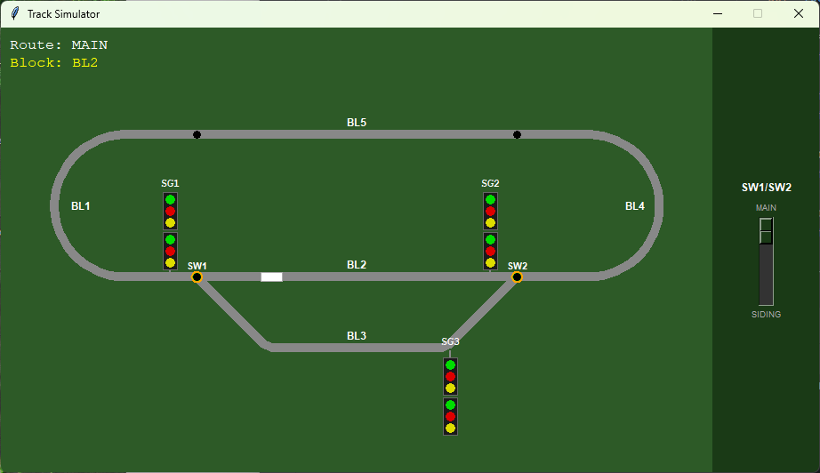

# Track Simulator

A Python/tkinter visual train simulator featuring an oval main loop with a passing siding.



## Requirements

- Python 3.14+
- tkinter (included in the standard library)

## Running

```bash
python main.py
```

## Controls

| Key / Control | Action |
|---|---|
| SW1/SW2 slider (panel) | Toggle between main route and siding |

## Track Layout

The track is a rounded rectangle (stadium shape) with a passing siding below the bottom straight.

```
        BL5 (top straight)
    ┌──────────────────────────┐
BL1 │                          │ BL4
    └──SW1──────────────SW2────┘
        BL2 (bottom straight)
        SW1──BL3 (siding)──SW2
```

**Blocks:**

| Block | Location |
|---|---|
| BL1 | Left semicircle |
| BL2 | Bottom main straight (SW1 → SW2) |
| BL3 | Siding U-shape below bottom straight |
| BL4 | Right semicircle |
| BL5 | Top straight |

**Signals:** SG1 (left switch area), SG2 (right switch area), SG3 (siding, right end)

## Project Structure

| File | Description |
|---|---|
| `main.py` | App entry point — tkinter window, canvas, 60 fps animation loop |
| `track.py` | `Segment` (polyline + parametric position/angle), `Track` builder |
| `train.py` | `Train` — speed, route selection, block detection |
| `signals.py` | `Signal` — two-frame, three-light railway signal widget |
